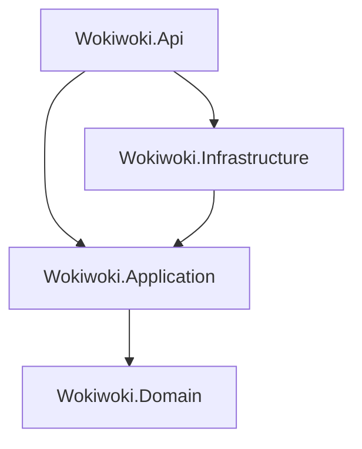

# Wokiwoki — Workshop Booking Platform API

<div align="center">


**A production-ready RESTful backend for a workshop discovery and booking platform.**  
Built with Clean Architecture on ASP.NET Core 8, powered by Azure cloud services.

</div>

---

## 📋 Table of Contents

- [Overview](#-overview)
- [Tech Stack](#-tech-stack)
- [Architecture](#-architecture)
- [Domain Model](#-domain-model)
- [API Endpoints](#-api-endpoints)
- [Key Features](#-key-features)
- [Project Structure](#-project-structure)
- [Getting Started](#-getting-started)
- [Configuration](#-configuration)
- [Database Migrations](#-database-migrations)

---

## 🧩 Overview

**Wokiwoki** is a platform that connects workshop organizers with participants. Organizers can list workshops with schedules, ticketing, and media; participants can discover, book, review, and chat about workshops. The API handles the full lifecycle — from authentication and discovery through booking, payment confirmation, and real-time notifications.

---

## 🛠️ Tech Stack

| Layer | Technology |
|---|---|
| Runtime | .NET 8 / ASP.NET Core 8 |
| Language | C# 12 |
| ORM | Entity Framework Core 8 (Npgsql) |
| Database | PostgreSQL (Supabase) |
| Caching | Redis (StackExchange.Redis) |
| Identity | ASP.NET Core Identity + JWT Bearer |
| Real-time | SignalR (`BookingHub`) |
| Message Bus | Azure Service Bus |
| File Storage | Azure Blob Storage |
| AI / Chat | Azure OpenAI & Google Gemini (GenAI) |
| Email | FluentEmail + MailKit (Gmail SMTP) |
| Mapping | AutoMapper 14 |
| PDF / QR | QuestPDF + QRCoder |
| Maps | Goong Maps API |
| Payment | Sepay / VietQR |
| Auth (OAuth) | Google Sign-In (`Google.Apis.Auth`) |
| API Docs | Swagger / Swashbuckle (OpenAPI v1) |

---

## 🏛️ Architecture

The project follows **Clean Architecture** (also known as Onion Architecture), enforcing strict separation of concerns across four layers:

```
┌──────────────────────────────────────────┐
│              Wokiwoki.Api                │  ← HTTP Controllers, Middlewares, Hubs
├──────────────────────────────────────────┤
│          Wokiwoki.Application            │  ← Features, Services, DTOs, Interfaces
├──────────────────────────────────────────┤
│           Wokiwoki.Domain                │  ← Entities, Enums, Events, Base classes
├──────────────────────────────────────────┤
│        Wokiwoki.Infrastructure           │  ← EF Core, Repositories, External Services
└──────────────────────────────────────────┘
```

**Dependency rule:** Each layer only depends on the layer directly below it. `Domain` has zero external dependencies.



---

## 🗂️ Domain Model

Core entities in the system:

| Entity | Description |
|---|---|
| `Workshop` | The main listing — title, description, schedule type, delivery type, pricing, ratings |
| `WorkshopSchedule` | Recurring or one-time date/time slots for a workshop |
| `WorkshopSession` | An individual session instance for a schedule |
| `WorkshopScheduleTicket` | Ticket types and pricing per schedule |
| `Ticket` | A purchased ticket belonging to a booking |
| `Booking` | A user's reservation for a workshop session |
| `Organization` | The organizer entity that owns workshops |
| `OrganizationPayoutAccount` | Bank/payout details for an organizer |
| `Category` | Taxonomy for browsing workshops |
| `Tag` | Flexible labels for workshop discovery |
| `Review` | User ratings and text reviews on workshops |
| `UserWorkshopLike` | Saved/liked workshops per user |
| `UserTagPreference` | Personalization tags chosen by a user |
| `UserOrganizationFollow` | Follow relationships between users and orgs |
| `WorkshopMedia` | Gallery images for a workshop |
| `WorkshopHeroMedia` | Hero / banner images for a workshop |
| `ConversationChat` | A chat thread (e.g., between user and chatbot/org) |
| `MessageChat` | Individual messages in a conversation |
| `AuditLog` | Administrative audit trail |
| `RefreshToken` | JWT refresh token storage |

---

## 📡 API Endpoints

All routes are prefixed with `/api`. JWT Bearer token is required for protected routes.

| Controller | Base Route | Highlights |
|---|---|---|
| `AuthsController` | `/api/auths` | Register, Login, Google OAuth, Refresh Token, Logout |
| `UsersController` | `/api/users` | Profile, preferences, tag interests |
| `WorkshopsController` | `/api/workshops` | CRUD, search, filtering, publish/unpublish |
| `WorkshopScheduleController` | `/api/workshop-schedules` | Manage recurring and one-time schedules |
| `WorkshopSessionController` | `/api/workshop-sessions` | Session management per schedule |
| `WorkshopScheduleTicketController` | `/api/schedule-tickets` | Ticket types and capacity per schedule |
| `WorkshopMediasController` | `/api/workshop-medias` | Gallery image upload/delete (Azure Blob) |
| `WorkshopHeroMediasController` | `/api/workshop-hero-medias` | Hero/banner media management |
| `BookingController` | `/api/bookings` | Create, confirm, cancel bookings |
| `OrganizationsController` | `/api/organizations` | Org profile, follow, workshops under org |
| `PayoutAccountsController` | `/api/payout-accounts` | Bank account registration for orgs |
| `CategoriesController` | `/api/categories` | Browse all workshop categories |
| `TagsController` | `/api/tags` | Manage and retrieve tags |
| `ReviewController` | `/api/reviews` | Submit and fetch workshop reviews |
| `ChatsController` | `/api/chats` | AI-powered chatbot conversations |
| `AddressController` | `/api/address` | Location lookup via Goong Maps |
| `BanksController` | `/api/banks` | Fetch bank list for VietQR |
| `SepayController` | `/api/sepay` | Sepay payment webhook handler |
| `DashboardController` | `/api/dashboard` | Analytics and stats for organizers |
| `AdminController` | `/api/admin` | Admin panel — user management, audit logs |
| `UserWorkshopLikesController` | `/api/likes` | Like/unlike workshops |

### Real-Time Hub

| Hub | Route | Description |
|---|---|---|
| `BookingHub` | `/hubs/booking` | SignalR hub for live booking status notifications |

---

## ✨ Key Features

### 🔐 Authentication & Authorization
- **JWT Bearer** authentication with configurable expiry and zero clock skew
- **Refresh Token** rotation stored in the database
- **Google OAuth 2.0** sign-in support
- Role-based authorization: `admin` and `customer` policies

### 🗓️ Workshop Management
- Workshops support **Online**, **Offline**, and **Hybrid** delivery types
- Schedules can be **Recurring** or **One-Time**
- Configurable registration deadline, refund policies, and seating capacity
- Geo-location support (latitude/longitude + display address via Goong Maps)

### 🎟️ Booking & Ticketing
- Multi-ticket-type bookings per schedule
- Real-time booking status pushed via **SignalR** (`BookingHub`)
- Payment integration via **Sepay** webhook and **VietQR** QR code generation
- QR ticket generation with **QRCoder** and PDF output via **QuestPDF**

### 🤖 AI-Powered Chatbot
- Conversational chatbot using **Azure OpenAI** and **Google Gemini**
- Per-user conversation threads stored in the database

### 📦 Media & Storage
- Workshop gallery and hero image upload to **Azure Blob Storage**
- Organized container management with configurable file-type and size constraints

### 📧 Email Notifications
- Async email delivery via **Azure Service Bus** queue
- Templated emails rendered with **Razor** views through **FluentEmail + MailKit**
- Hosted background service (`EmailConsumerHosted`) processes the queue

### ⚡ Caching
- **Redis** cache layer (`IRedisCacheService`) for frequently accessed data (e.g., listings, filters)

### 🔍 Observability
- `PerformanceMiddleware` — logs request execution time
- `GlobalExceptionMiddleware` — centralized error handling and consistent error responses
- EF Core detailed query logging in development

---

## 📁 Project Structure

```
Wokiwoki/
├── src/
│   ├── Wokiwoki.Api/                  # Entry point — controllers, hubs, middlewares
│   │   ├── Controllers/               # 23 REST controllers
│   │   ├── Hubs/                      # BookingHub (SignalR)
│   │   ├── Middlewares/               # GlobalException, Performance
│   │   ├── Services/                  # BookingNotificationService
│   │   ├── Request/                   # Request models
│   │   ├── Program.cs
│   │   ├── DependencyInjection.cs
│   │   └── appsettings.json
│   │
│   ├── Wokiwoki.Application/          # Business logic, DTOs, interfaces
│   │   ├── Features/                  # 20 feature slices (CQRS-style)
│   │   │   ├── Auth/
│   │   │   ├── Bookings/
│   │   │   ├── Workshops/
│   │   │   ├── Organizations/
│   │   │   ├── Reviews/
│   │   │   ├── Chatbots/
│   │   │   └── ... (20 total)
│   │   ├── DTOs/
│   │   ├── Common/
│   │   └── DependencyInjection.cs
│   │
│   ├── Wokiwoki.Domain/               # Core domain — zero dependencies
│   │   ├── Entities/                  # 20 entity classes
│   │   ├── Enums/                     # WorkshopStatus, DeliveryType, etc.
│   │   ├── Events/                    # Domain events
│   │   └── Common/                    # Base entity classes
│   │
│   └── Wokiwoki.Infrastructure/       # EF Core, repos, external services
│       ├── Data/                      # DbContext, configurations, migrations
│       ├── Repositories/              # 15+ repository implementations
│       ├── Services/                  # Email, Blob, Redis, Token, Google, Goong, etc.
│       ├── Identity/                  # ApplicationUser, IdentityService
│       └── DependencyInjection.cs
│
└── README.md
```

---

## 🚀 Getting Started

### Prerequisites

- [.NET 8 SDK](https://dotnet.microsoft.com/download/dotnet/8)
- [PostgreSQL](https://www.postgresql.org/) (or a [Supabase](https://supabase.com/) project)
- [Redis](https://redis.io/) instance (local or Redis Cloud)
- Azure subscription (Blob Storage + Service Bus) — optional for local dev
- Google Cloud project with OAuth 2.0 credentials — optional for local dev

### 1. Clone the repository

```bash
git clone https://github.com/your-org/wokiwoki-backend.git
cd wokiwoki-backend
```

### 2. Configure environment variables

Copy the example env file and fill in your credentials:

```bash
cp src/Wokiwoki.Api/appsettings.example.json src/Wokiwoki.Api/appsettings.Development.json
```

Or create a `.env` file in `src/Wokiwoki.Api/` (loaded automatically in Development):

```env
ConnectionStrings__DefaultConnection=Host=localhost;Database=wokiwoki;Username=postgres;Password=yourpassword

Jwt__Key=your-super-secret-key-min-32-chars
Jwt__Issuer=https://localhost:5001
Jwt__Audience=https://localhost:5001
Jwt__ExpiryTime=120

Smtp__From=no-reply@yourdomain.com
Smtp__SmtpServer=smtp.gmail.com
Smtp__Port=587
Smtp__UserName=your@gmail.com
Smtp__Password=your-app-password
Smtp__SecureSocketOptions=StartTls

AzureBlob__ConnectionString=<your-azure-blob-connection-string>
AzureBlob__DefaultContainer=default

AzureServiceBus__ConnectionString=<your-service-bus-connection-string>

Redis__Endpoint=localhost
Redis__Password=

Google__ClientId=<your-google-client-id>

AzureOpenAI__Endpoint=<your-azure-openai-endpoint>
AzureOpenAI__ApiKey=<your-azure-openai-key>

Gemini__ApiKey=<your-gemini-api-key>

Goong__ApiKey=<your-goong-api-key>
```

### 3. Apply database migrations

```bash
cd src/Wokiwoki.Api
dotnet ef database update --project ../Wokiwoki.Infrastructure
```

### 4. Run the API

```bash
dotnet run --project src/Wokiwoki.Api
```

The API will start at `https://localhost:5001`. Swagger UI is available at:

```
https://localhost:5001/swagger
```

---

## ⚙️ Configuration

| Key | Description |
|---|---|
| `ConnectionStrings:DefaultConnection` | PostgreSQL connection string |
| `Jwt:Key` | Signing key (min 32 characters) |
| `Jwt:ExpiryTime` | Access token lifetime in minutes |
| `AzureBlob:ConnectionString` | Azure Blob Storage connection |
| `AzureServiceBus:ConnectionString` | Azure Service Bus connection |
| `Redis:Endpoint` | Redis server host |
| `Redis:Password` | Redis authentication password |
| `Google:ClientId` | Google OAuth client ID |
| `AzureOpenAI:Endpoint` / `ApiKey` | Azure OpenAI service credentials |
| `Gemini:ApiKey` | Google Gemini API key |
| `Goong:ApiKey` | Goong Maps API key |
| `SepayApiKey` | Sepay payment gateway key |
| `Swagger:Enabled` | Enable Swagger in non-development environments |

---

## 🗃️ Database Migrations

```bash
# Add a new migration
dotnet ef migrations add <MigrationName> \
  --project src/Wokiwoki.Infrastructure \
  --startup-project src/Wokiwoki.Api

# Apply migrations
dotnet ef database update \
  --project src/Wokiwoki.Infrastructure \
  --startup-project src/Wokiwoki.Api

# Revert last migration
dotnet ef migrations remove \
  --project src/Wokiwoki.Infrastructure \
  --startup-project src/Wokiwoki.Api
```

---

## 📄 License

This project is private and proprietary. All rights reserved © Wokiwoki Team.